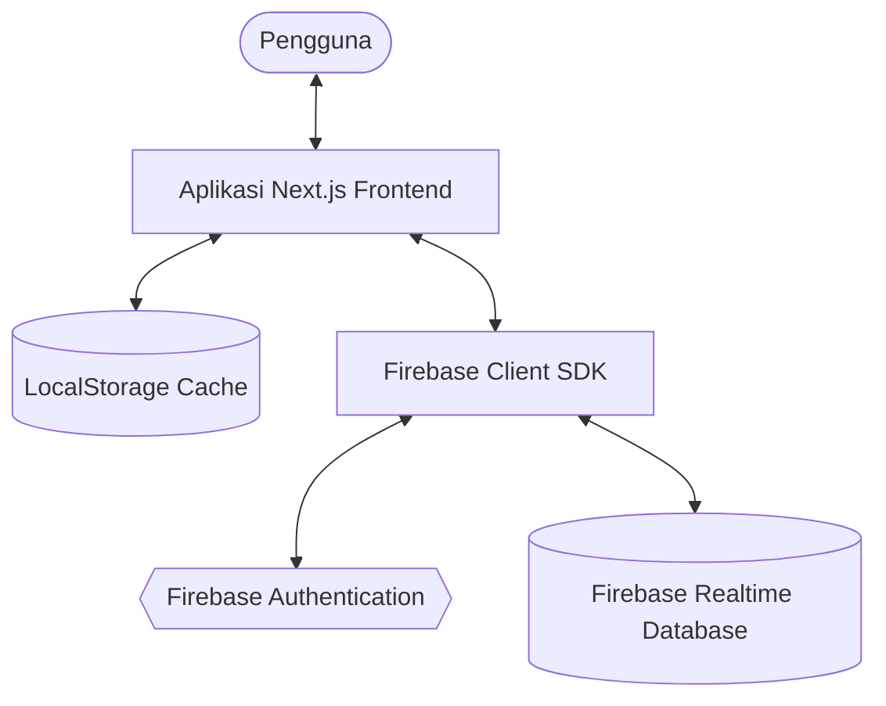
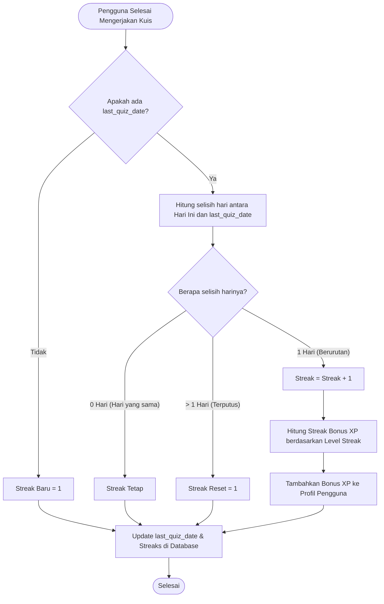
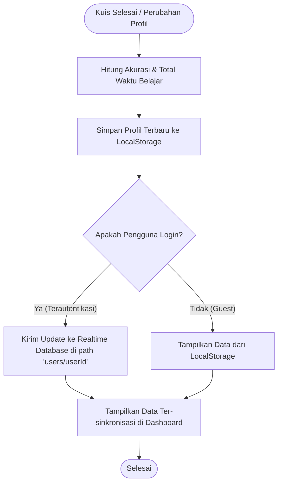

# Gameducate 🎮📚

**Gameducate** adalah platform web pembelajaran interaktif berbasis gamifikasi yang dirancang untuk meningkatkan literasi digital pengguna melalui modul edukasi interaktif dan simulasi deteksi hoax. Proyek ini dikembangkan sebagai bagian dari **Program Magang — Semester 6**.

---

## 🚀 Fitur Utama

1. **Learning Path (Petualangan Belajar)**:
   Peta jalur pembelajaran terstruktur yang memandu pengguna melalui 6 modul penting literasi digital:
   * **Keamanan Password**: Membuat benteng pertahanan digital untuk menangkal peretasan.
   * **Detektif Hoax**: Mengasah kemampuan membedakan fakta dan berita bohong di internet.
   * **Jejak Digital**: Memahami jejak digital aktif/pasif dan cara menjaganya tetap bersih.
   * **Etika Chatting**: Mempelajari tata krama berkomunikasi (netiket) di dunia digital.
   * **Privasi Data**: Melindungi informasi pribadi sensitif dari penyalahgunaan.
   * **Phishing Alert**: Mengenali umpan penipuan dan link berbahaya.
2. **Game Quiz Detektif Hoax**:
   Simulasi media sosial interaktif di mana pengguna berperan sebagai detektif untuk menguji postingan viral apakah bernada **Hoax** atau **Fakta**. Dilengkapi dengan indikator nyawa (maksimal 3) dan penjelasan detail keamanan untuk mengedukasi pengguna.
3. **Gamification Engine**:
   * **Level & XP**: Pengguna mendapatkan XP setiap kali menyelesaikan kuis. Level akan otomatis meningkat dengan kenaikan eksponensial.
   * **Sistem Badge (Lencana)**: 6 lencana pencapaian (Truth Finder, Security Ace, Kindness Hero, Privacy Guard, Phishing Detector, Digital Citizen) yang tingkatannya (level 1-5) bertambah berdasarkan performa belajar.
   * **Daily Streak Tracker**: Melacak keaktifan harian pengguna dengan bonus XP tambahan untuk mendorong kebiasaan belajar.
   * **Global Leaderboard**: Menampilkan peringkat pengguna secara real-time berdasarkan total XP yang didapatkan dari pengerjaan modul.
   * **Aktivitas Terbaru**: Log riwayat pencapaian pengguna (menyelesaikan modul, mendapatkan badge baru, dll).

---

## 🛠️ Tech Stack & Backend Architecture

* **Frontend Framework**: Next.js 15 (App Router) & React 19
* **Programming Language**: TypeScript / JavaScript
* **Styling**: Tailwind CSS & Vanilla CSS (untuk layout adaptif dan premium)
* **Animations**: Framer Motion (untuk animasi transisi halaman, micro-interactions, dan efek hover)
* **Icons**: Lucide React
* **Backend Database & Auth**:
  * **Firebase Authentication**: Untuk sistem login dan register pengguna.
  * **Firebase Realtime Database**: Untuk sinkronisasi data profil, statistik belajar, badge, dan aktivitas secara real-time.
  * **LocalStorage Cache**: Menyimpan data lokal sebagai cadangan (fallback) untuk pengguna mode Guest agar kemajuan belajar tidak hilang meski tidak masuk akun.

---

## 📊 Database Schema (JSON Structure)

Data pengguna disimpan di Firebase Realtime Database pada path `users/{userId}` dengan format sebagai berikut:

```json
{
  "users": {
    "USER_ID": {
      "id": "string",
      "full_name": "string | null",
      "avatar_url": "string | null",
      "module_progress": {
        "module-slug": {
          "completed": "boolean",
          "score": "number",
          "accuracy": "number",
          "completedAt": "string (ISO Date)"
        }
      },
      "quiz_accuracy": "number (0-100)",
      "learning_time": "number (dalam menit)",
      "xp_level": "number",
      "streaks": "number",
      "last_quiz_date": "string (ISO Date) | null",
      "achievement_badges": [
        {
          "id": "string",
          "name": "string",
          "icon": "string (nama ikon Lucide)",
          "level": "number (0-5)",
          "maxLevel": 5,
          "description": "string",
          "unlockedAt": "string (ISO Date)",
          "color": "string"
        }
      ],
      "user_activities": [
        {
          "id": "string",
          "title": "string",
          "description": "string",
          "timestamp": "string (ISO Date)",
          "type": "module_complete | quiz_score | badge_earned | joined"
        }
      ],
      "updated_at": "string (ISO Date)"
    }
  }
}
```

---

## 🔄 Flowchart & Algoritma Utama

Berikut adalah diagram alur logika utama yang diterapkan pada aplikasi Gameducate:

### 1. Arsitektur Komunikasi Data
Menjelaskan bagaimana UI Next.js bertukar data dengan Firebase Auth, Realtime Database, dan LocalStorage fallback.



### 2. Algoritma Perhitungan Streak Harian (Daily Streak)
Digunakan untuk menghitung keaktifan belajar pengguna berturut-turut serta memberikan bonus XP yang sesuai.



* **Formula XP Naik Level**:
  $$\text{xpToNextLevel} = 500 \times 1.25^{(\text{level} - 1)}$$
* **Skema Bonus XP Streak**:
  * Streak $\ge 3$ hari: $+20$ XP
  * Streak $\ge 7$ hari: $+50$ XP
  * Streak $\ge 14$ hari: $+100$ XP
  * Streak $\ge 30$ hari: $+200$ XP

### 3. Sinkronisasi Data & Game Progress
Mengatur pembaruan profil secara instan di sisi lokal maupun server saat pengguna menyelesaikan kuis.



---

## 🚀 Panduan Instalasi Lokal

### Prasyarat
* Node.js versi 18+ atau yang terbaru
* Akun Firebase dengan layanan Realtime Database & Authentication aktif

### Langkah Setup

1. **Clone repository & Install dependencies**:
   ```bash
   npm install
   ```

2. **Setup Environment Variables**:
   Buat file `.env.local` pada folder root dan isi kredensial Firebase Anda:
   ```env
   NEXT_PUBLIC_FIREBASE_API_KEY=your_api_key
   NEXT_PUBLIC_FIREBASE_AUTH_DOMAIN=your_auth_domain
   NEXT_PUBLIC_FIREBASE_DATABASE_URL=your_database_url
   NEXT_PUBLIC_FIREBASE_PROJECT_ID=your_project_id
   NEXT_PUBLIC_FIREBASE_STORAGE_BUCKET=your_storage_bucket
   NEXT_PUBLIC_FIREBASE_MESSAGING_SENDER_ID=your_sender_id
   NEXT_PUBLIC_FIREBASE_APP_ID=your_app_id
   ```

3. **Jalankan Aplikasi dalam Mode Pengembangan**:
   ```bash
   npm run dev
   ```
   Buka [http://localhost:3000](http://localhost:3000) pada browser Anda.

### Perintah NPM Lainnya
* `npm run build` - Membuat bundle produksi aplikasi.
* `npm run start` - Menjalankan server lokal mode produksi.
* `npm run lint` - Menganalisis kode dengan ESLint untuk menemukan masalah sintaksis.

---

**Status Proyek**: 🚧 In Development (Magang Semester 6).
